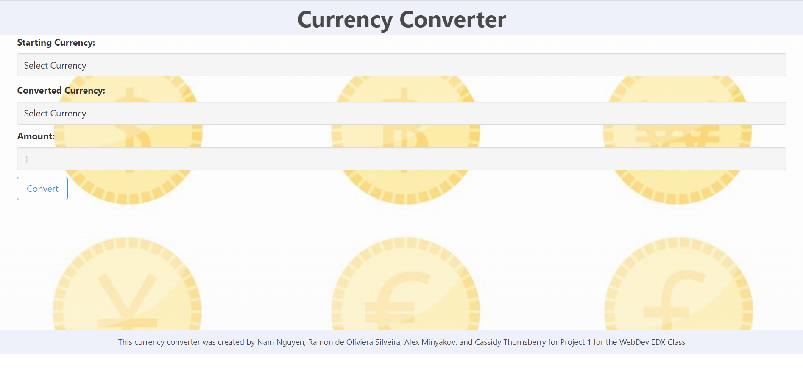
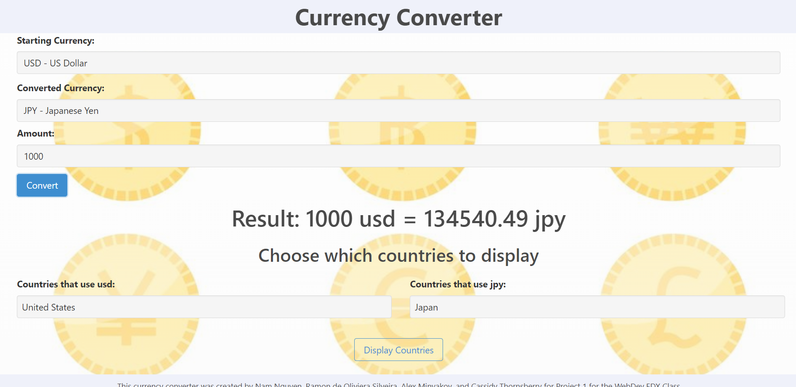
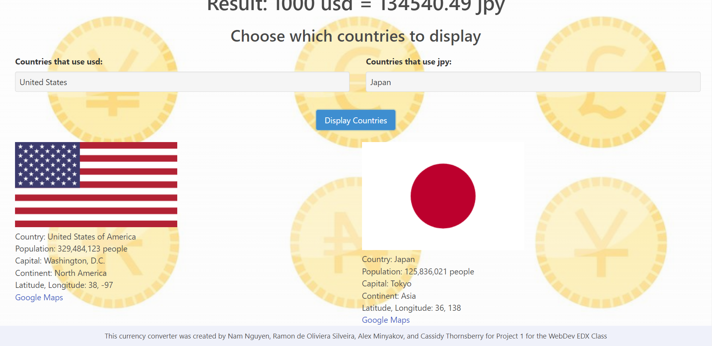

# Project 1: Country Currency Converter

## Collaborators
Nam Nguyen
Ramon Oliveira Da Silveira
Alex Minyakov
Cassidy Thornsberry

## Description
The goal of this project is to work with a group and use two APIs to create an application. We chose to use a currency exchange rate API and a country data API. Our application asks the user to select a starting form of currency, a form of currency to exchange into, and an amount for the starting currency. The application gives the amount in terms of the exchanged currency. Then the user will have the option to display data from the countries that use the forms of currency. Most currencies are only used in one country, but there are some that have multiple places that use it. When selecting the countries, it displays the information such as the country flag, official name, population, continent the country is in, the capital, longitude and latitude and a link to the google maps.

## Usage
The applications can be accessed via https://namhn123.github.io/Currency-Converter/

